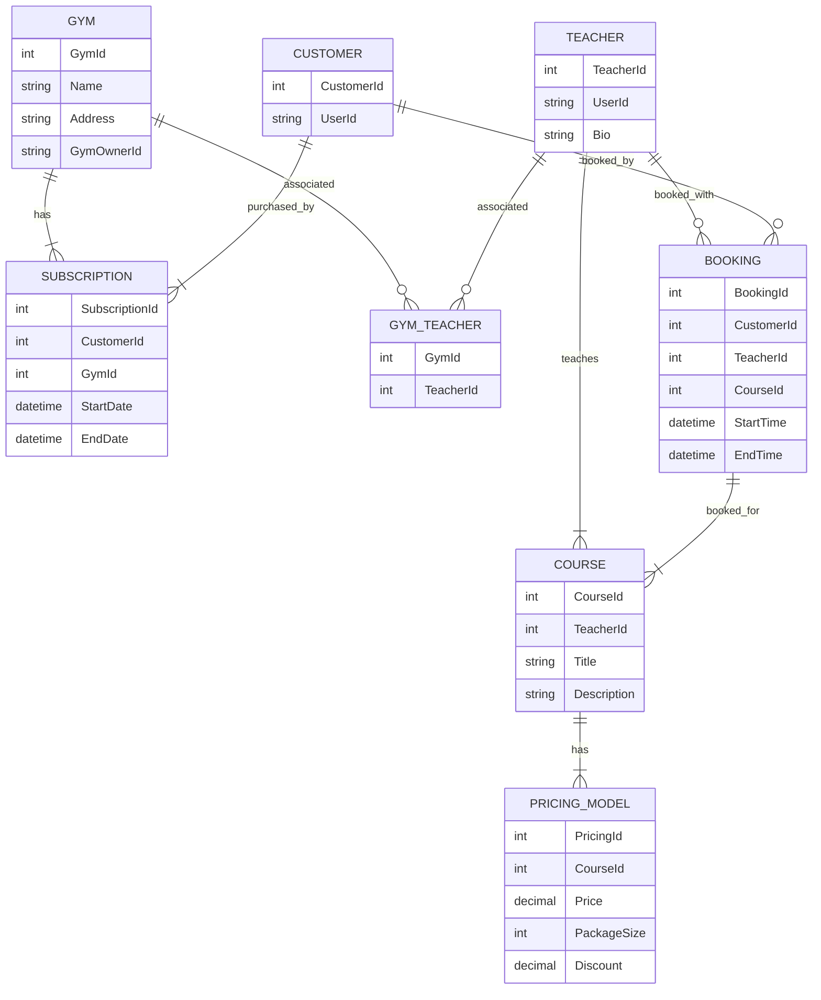

# OpenGym - Your best tool to manage your GYM

## Architecture image

## Domains mermaid diagram

## Figma that we could possibly use but we don't have the time
Link to Figma: https://www.figma.com/file/3pebDmor5Z697n1IpySU8E/OpenGym

## To run:
- Clone and load the project the devcontainer in vscode or in a codespace
- f5